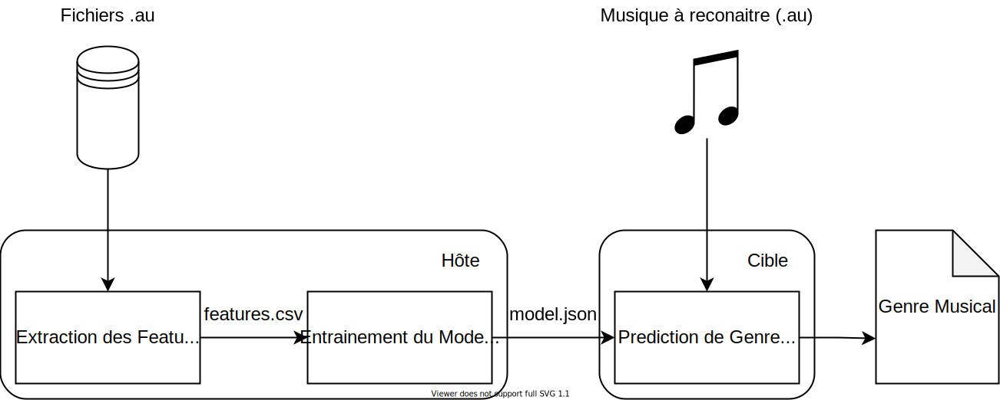
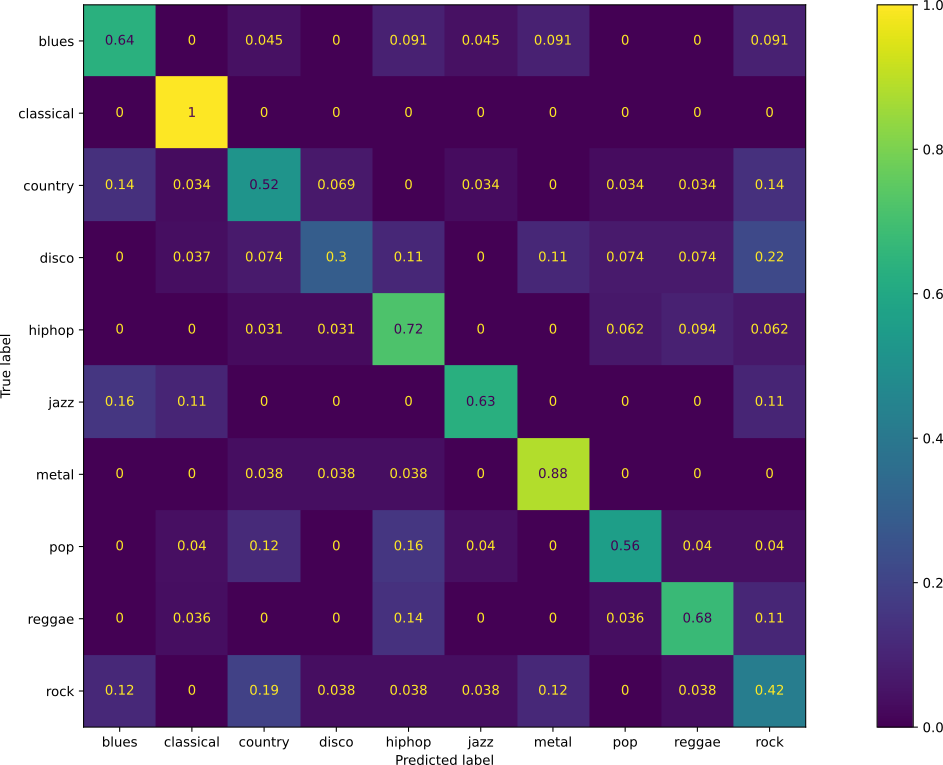

# Embedded Machine Learning | Reconnaissance de Genre musicaux
<table>
    <tbody>
    	<tr>
        	<td>Jules</td>
            <td>BERHAULT</td>
            <td>FISE 2021 ROB</td>
        </tr>
        <tr>
        	<td>Pierre-Yves</td>
            <td>JÉZÉGOU</td>
            <td>FIPA 2021 SE</td>
        </tr>
    </tbody>
</table>
# Objectifs
Ce projet à pour objectif de produire une chaine complète d'Intelligence Artificielle pour la prédiction du genre musical d'un morceau parmi un base de données de [genres musicaux](https://www.kaggle.com/carlthome/gtzan-genre-collection) sur une cible Embarqué dans notre cas une [Raspberry PI 4](https://www.raspberrypi.org/products/raspberry-pi-4-model-b/) utilisant un Debian 10 64 bit
<figure>
    
    <figcaption >Fig 1. Chaine de Machine Learning du projet</figcaption>
</figure>

# Extraction des Features
Ce Programme s'exécute sur la machine hôte, il parcours le dossier de la base de donnée audio et pour chaque fichier il viens calculer la STFT du fichier (fenêtre de 512 échantillons) et ensuite a partir des Bins calculer il vient calculer la moyenne et l'écart-type de chaque échantillon fréquentiels dans les Bins 
Commande d'exécution: 

```bash
./build/features_extraction/features_extract -i <Adresse du dossier audio> -o <Adresse de features.csv> [-v] # v for verbosity 
```
format du csv:
```
avg1, avg2, ... , avg(FFT_SIZE)/2, stddev1, stddev2, ... ,stddev(FFT_SIZE)/2, "Genre"
```
# Entrainement du model
Pour ce programme on a choisi un model de type SVM recherchant les meilleurs Hyper-paramètres suivant les Features afin de maximiser les performances du model
Commande d'exécution: 
```bash
python learning/main.py -i <Adresse de features.csv> -o <Adresse de model.csv> [-v] # v for verbosity
```


format du json:
```json
{
    "intercept": [],
    "coeffs":[[],[],[],[],[],[],[],[],[],[]],
	"normalisation":{"average": [],"std": []},
    classes:{"<class_id>": "<class_name>",}
}
```
# Prédiction 
Ce programme réalise la prédiction du genre de musique d'un fichier audio (`.au`) a partir du modèle entrainer exporté en JSON
Commande d'exécution: 

```bash
./build/predicting/predict -m <Adresse du model.json> -a <Adresse du fichier Audio> [-v] # v for verbosity 
```
Sortie:
```
Predicting W/ Model from: "../model.json"
Predicting style of: "../assets/classical/classical.00042.au"
Start the processing of the file to guess the style of
Best guess on music style for ../assets/classical/classical.00042.au is "classical" W/ a Factor of: 11.29
```
# Performances
Avec les SVM on obtiens environs 60% de bonne prédictions:
<figure>
    
    <figcaption>Fig 2. Confusion Matrix du Model</figcaption>
</figure>